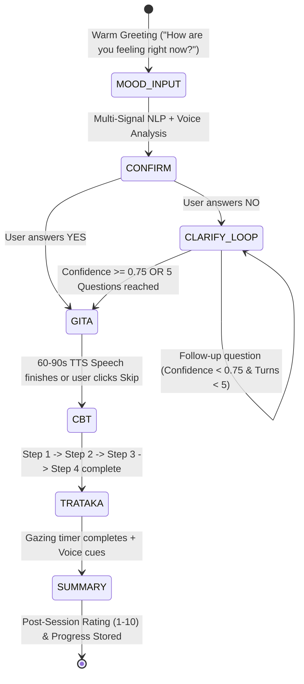

# 4-Phase Guided Wellness Conversation Flow

An evidence-based, voice-first clinical companion architecture integrating Ayurvedic Sattvavajaya Chikitsa, Bhagavad Gita philosophical contemplation, Cognitive Behavioral Therapy (CBT), and Neuro-Ocular Trataka gazing.

---

## 🌟 Architecture Overview

The system operates as a deterministic, persistent finite-state machine (FSM) that automatically escorts the user through four clinical phases:



---

## 🧘 The 4 Phases

### Phase 1: Mood Understanding & Clarification Loop
1. **Warm Greeting**: Initiates with a compassionate spoken open question:
   - English: *"Welcome to your sanctuary. Take a gentle breath. How are you feeling right now?"*
   - Hindi: *"आपके अपने शांत शरणस्थल में स्वागत है। एक गहरी, सुखद सांस लें। आप अभी कैसा महसूस कर रहे हैं?"*
2. **Multi-Signal Fusion**:
   - **Text Analysis**: Emotion, sentiment, and root theme classification (anxiety, sadness, anger, stress, loneliness, guilt, fear, overthinking, low motivation).
   - **Voice Biomarkers**: Pitch ($F_0$), speech rate (rapid vs hesitant), volume variations (RMS energy), and pitch perturbation / tremor detection.
   - **Internal Profile**: `{ primary_emotion, secondary_emotion, intensity (1-10), confidence (0-1), root_theme }`.
3. **Confirmation Step**:
   - The app verbalizes its understanding:
     *"It sounds like you're feeling anxious about work and finding it hard to relax. Is that right?"*
   - Clear, accessible **YES** and **NO** buttons (or spoken affirmative / negative).
4. **Clarification Loop** (if user responds **NO**):
   - Generates up to 5 short empathetic follow-up questions one-by-one:
     1. *Trigger*: What triggered this feeling for you today?
     2. *Somatic*: Where do you feel this tension or weight in your body?
     3. *Duration*: How long has this feeling been lingering with you?
     4. *Sleep & Appetite*: How has your sleep and appetite been lately?
     5. *Person vs Situation vs Thoughts*: Is this primarily about a person, an external situation, or repetitive thoughts?
   - **Loop Cap & Guardrail**: Automatically terminates as soon as confidence reaches **$\ge 0.75$** or after **5 questions**. Refines the profile, confirms once more, and transitions directly to Phase 2.

### Phase 2: Bhagavad Gita Wisdom
- Maps the mood profile to authentic verses stored in [`data/wellness_flow/gita_verses.json`](file:///c:/Users/manis/EIH/data/wellness_flow/gita_verses.json).
- Reads aloud:
  1. The chapter and verse reference (e.g., Chapter 2, Verse 47).
  2. Sacred Sanskrit shloka with phonetic Roman transliteration.
  3. Simple, compassionate meaning in English or Hindi.
  4. What the Gita says about this specific root problem.
  5. A practical, everyday life solution.
- Calibrated to **60 to 90 seconds of speech**.
- Dedicated **Replay** and **Skip to CBT** controls.
- Automatically transitions to Phase 3 upon completion.

### Phase 3: Cognitive Behavioral Therapy (CBT) Mini-Flow
- Loads tailored scripts from [`data/wellness_flow/cbt_scripts.json`](file:///c:/Users/manis/EIH/data/wellness_flow/cbt_scripts.json):
  1. **Step 1 (Identify Thought)**: Identifies the automatic negative thought. User responds by voice or text.
  2. **Step 2 (Name Distortion)**: Names the cognitive distortion (Catastrophizing, Mind Reading, All-or-Nothing Thinking, Mental Filter, Should Statements, Personalization).
  3. **Step 3 (Challenge Evidence)**: Asks evidence-based Socratic challenge questions. User responds by voice or text.
  4. **Step 4 (Balanced Thought & Action)**: Offers a balanced replacement thought and one concrete, small action step.
- Saves all user responses and automatically advances to Phase 4.

### Phase 4: Neuro-Ocular Trataka (Best 1 of 5)
A rule-based selector in [`lib/wellness-flow/trataka-selector.ts`](file:///c:/Users/manis/EIH/lib/wellness-flow/trataka-selector.ts) selects the single best variant based on **mood**, **intensity (1-10)**, and **time of day**:

| Variant | Sanskrit Name | Best Mapped Conditions | Clinical Mechanism |
| :--- | :--- | :--- | :--- |
| **Candle Flame** | *Jyoti Trataka* | Racing anxiety, mental overthinking, evening stress | Rhythmic luminance resets retinal photoreceptors and calms sympathetic tone |
| **Bindu (Dot)** | *Bindu Trataka* | Anger, acute restlessness, agitation (intensity $\ge 8$) | Motionless foveal convergence grounds amygdalar fight/flight signaling |
| **Om Symbol** | *Murti / Mandala Trataka* | Daytime sadness, low motivation, existential loneliness | Concentric sacred geometry stimulates bilateral occipital coherence |
| **Moon / Star** | *Shoonya Trataka* | Nighttime sadness, cognitive fatigue, insomnia | Panoramic nocturnal visual field quiets the Default Mode Network (DMN) |
| **Mirror / Reflection**| *Pratibimb Trataka* | Toxic shame, guilt, self-doubt, imposter syndrome | Mirror-neuron ventral vagal engagement dissolves harsh self-criticism |

- **Guided Experience**:
  - Reads aloud the clinical rationale for the choice.
  - Interactive on-screen visual focus object (flickering candle flame, golden bindu, glowing Om, crescent moon & stars, or front camera mirror).
  - Countdown timer (1 min for acute distress, 2 min standard, 3 min gentle).
  - Gentle audio voice cues: **Begin** $\rightarrow$ **Blink naturally** $\rightarrow$ **Close eyes** $\rightarrow$ **Relax**.
  - Concludes with closing reflection and **Post-Session Mood Rating (1-10)** to track progress.

---

## 🔒 Privacy & Safety Features

1. **Zero-Knowledge Encryption**:
   - All saved mood profiles, thoughts, and session states are encrypted client-side using **AES-GCM-256** with PBKDF2 key derivation via [`lib/db/crypto.ts`](file:///c:/Users/manis/EIH/lib/db/crypto.ts).
   - Audio is analyzed locally in memory. Zero voice recordings are uploaded to external servers.
2. **Explicit Microphone Consent**:
   - An explicit consent dialog appears before microphone capture begins.
   - Text-only fallback is permanently available if the microphone is denied or muted.
3. **Safety & Crisis Guardrails**:
   - Immediate deterministic deflection if self-harm, suicidal ideation, or severe crisis is detected.
   - Instantly halts conversation flow and displays 24/7 crisis helplines:
     - **India Tele-MANAS**: Dial `14416` or toll-free `1-800-891-4416`.
     - US/Canada: `988`. UK: `111`.
   - Explicit clinical disclaimer: *"This app supports emotional wellness but is not a substitute for medical or therapeutic care."*

---

## 📁 Directory Structure & File Manifest

```
├── data/
│   └── wellness_flow/
│       ├── gita_verses.json            <- Editable Gita verses & practical solutions
│       ├── cbt_scripts.json            <- Editable CBT mini-flow distortion scripts
│       └── trataka_instructions.json   <- 5 Trataka variants & guided voice cues
├── lib/
│   └── wellness-flow/
│       ├── types.ts                    <- TypeScript data models & interfaces
│       ├── emotion-engine.ts           <- Modular NLP + Voice analysis & confirmation engine
│       ├── trataka-selector.ts         <- Rule-based variant selector
│       ├── storage-encryption.ts       <- AES-GCM-256 encryption & consent management
│       └── wellness-state-machine.ts   <- State machine with auto-progression & FSM controls
├── components/
│   └── wellness-flow/
│       └── GuidedWellnessConversation.tsx <- Voice-first conversational UX component
├── tests/
│   ├── wellness-flow.test.js           <- Unit tests (transitions, branches, 5-cap, Trataka)
│   └── run-all-tests.js                <- Master test runner
└── README-WELLNESS-FLOW.md
```

---

## 🛠️ How to Extend Content

### Adding a New Gita Verse
Edit [`data/wellness_flow/gita_verses.json`](file:///c:/Users/manis/EIH/data/wellness_flow/gita_verses.json) and add an item to `"verses"`:
```json
{
  "id": "bg_chapter_verse",
  "reference": "Chapter X, Verse Y",
  "reference_code": "BG X.Y",
  "sanskrit": "संस्कृत श्लोक",
  "transliteration": "Roman transliteration",
  "english_meaning": "English translation",
  "hindi_meaning": "हिन्दी अर्थ",
  "problem_analysis": "What the Gita says about this problem",
  "practical_solution": "Everyday actionable advice",
  "applicable_emotions": ["anxiety", "stress"],
  "root_themes": ["future_uncertainty"],
  "speech_text_en": "60-90 second English spoken text",
  "speech_text_hi": "60-90 second Hindi spoken text"
}
```

### Adding a New CBT Protocol
Edit [`data/wellness_flow/cbt_scripts.json`](file:///c:/Users/manis/EIH/data/wellness_flow/cbt_scripts.json) under `"scripts"`:
```json
"my_custom_mood": {
  "mood_key": "my_custom_mood",
  "distortion_id": "distortion_slug",
  "distortion_name_en": "Cognitive Distortion Name",
  "distortion_name_hi": "संज्ञानात्मक भ्रम का नाम",
  "step1_prompt_en": "Question identifying automatic negative thought",
  "step1_prompt_hi": "स्वचालित विचार पहचानने का प्रश्न",
  "step2_name_en": "Distortion naming explanation",
  "step2_name_hi": "भ्रम का स्पष्टीकरण",
  "step3_challenge_questions_en": ["Evidence challenge question 1", "Question 2"],
  "step3_challenge_questions_hi": ["चुनौती प्रश्न 1", "प्रश्न 2"],
  "step4_replacement_thought_en": "Balanced replacement thought",
  "step4_replacement_thought_hi": "संतुलित विचार",
  "step4_action_step_en": "Small action step",
  "step4_action_step_hi": "छोटा कदम"
}
```

---

## 🧪 Running Automated Tests

Run the dedicated test suite:
```bash
node tests/wellness-flow.test.js
```

Run the complete project test suite:
```bash
node tests/run-all-tests.js
```
